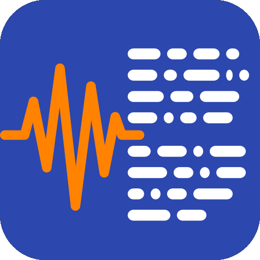

## Local Transcribe

Just a utility for offline audio transcription. It runs OpenAI's Whisper models locally in your browser so your audio doesn't leave your device.

Available at [https://localtranscribe.krets.com](https://localtranscribe.krets.com).

## Overview

It transcribes audio files on-device. No servers, no accounts, no tracking. It's a Progressive Web App, so you can install it and use it offline. It works well enough on modern smartphones.

- **Offline**: Uses Transformers.js to run Whisper models in the browser.
- **Private**: Audio stays on your hardware.
- **Caching**: Downloads the model once; works offline after that.
- **Share Target**: On mobile, you can share audio files directly to the app for transcription.

## Tech

- [Transformers.js](https://github.com/xenova/transformers.js) (OpenAI Whisper)
- IndexedDB for local history and model caching
- Service Workers for PWA/offline support

## License

MIT. Use it if you want.
